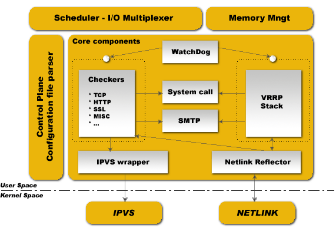

###############
Software Design
###############

Keepalived is written in pure ANSI/ISO C. The software is articulated around a
central I/O multiplexer that provides realtime networking design. The main
design focus is to provide a homogenous modularity between all elements. This
is why a core library was created to remove code duplication. The goal is to
produce a safe and secure code, ensuring production robustness and stability.

To ensure robustness and stability, daemon is split into 3 distinct processes:

* A minimalistic parent process in charge with forked children process monitoring.
* Two children processes, one responsible for VRRP framework and the other for healthchecking.

Each children process has its own scheduling I/O multiplexer, that way VRRP
scheduling jitter is optimized since VRRP scheduling is more sensible/critical
than healthcheckers. This split design minimalizes for healthchecking the usage
of foreign libraries and minimalizes its own action down to an idle mainloop in
order to avoid malfunctions caused by itself. 

The parent process monitoring framework is called watchdog, the design is each
children process opens an accept unix domain socket, then while daemon
bootstrap, parent process connect to those unix domain sockets and send periodic
(5s) hello packets to children. If parent cannot send hello packet to remotely
connected unix domain socket it simply restarts children process. 

This watchdog design offers 2 benefits, first of all, hello packets sent from
parent process to remotely connected children is done through I/O multiplexer
scheduler that way it can detect deadloop in the children scheduling framework.
The second benefit is brought by the uses of sysV signal to detect dead
children. When running you will see in process list::

    PID         111     Keepalived  <-- Parent process monitoring children
                112     \_ Keepalived   <-- VRRP child
                113     \_ Keepalived   <-- Healthchecking child

Kernel Components
*****************

Keepalived uses four Linux kernel components:

1. LVS Framework: Uses the getsockopt and setsockopt calls to get and set options on sockets.
#. Netfilter Framework: IPVS code that supports NAT and Masquerading.
#. Netlink Interface: Sets and removes VRRP virtual IPs on network interfaces.
#. Multicast:  VRRP advertisements are sent to the reserved VRRP MULTICAST group (224.0.0.18).

Atomic Elements
***************

Control Plane
=============

Keepalived configuration is done through the file keepalived.conf. A compiler
design is used for parsing. Parser work with a keyword tree hierarchy for
mapping each configuration keyword with specifics handler. A central
multi-level recursive function reads the configuration file and traverses the
keyword tree. During parsing, configuration file is translated into an internal
memory representation.

Scheduler - I/O Multiplexer
===========================

All the events are scheduled into the same process. Keepalived is a single
process. Keepalived is a network routing software, it is so closed to I/O. The
design used here is a central select(...) that is in charge of scheduling all
internal task. POSIX thread libs are NOT used. This framework provides its own
thread abstraction optimized for networking purpose.

Memory Management
=================

This framework provides access to some generic memory management functions like
allocation, reallocation, release,... This framework can be used in two modes:
normal_mode & debug_mode. When using debug_mode it provides a strong way to
eradicate and track memory leaks. This low-level env provides buffer under-run
protection by tracking allocation and release of memory. All the buffer used are
length fixed to prevent against eventual buffer-overflow.

Core Components
===============

This framework defines some common and global libraries that are used in all the
code. Those libraries are html parsing, link-list, timer, vector, string
formating, buffer dump, networking utils, daemon management, pid handling, 
low-level TCP layer4. The goal here is to factorize code to the max to limit as
possible code duplication to increase modularity.

WatchDog
========

This framework provides children processes monitoring (VRRP & Healthchecking).
Each child accepts connection to its own watchdog unix domain socket. Parent
process sends "hello" messages to this child unix domain socket. Hello messages
are sent using I/O multiplexer on the parent side and accepted/processed using
I/O multiplexer on children side. If the parent detects broken pipe it tests 
using sysV signal if child is still alive and restarts it.

Checkers
========

This is one of the main Keepalived functionality. Checkers are in charge of
realserver healthchecking. A checker tests if realserver is alive, this test ends
on a binary decision: remove or add realserver from/into the LVS topology. The
internal checker design is realtime networking software, it uses a fully
multi-threaded FSM design (Finite State Machine). This checker stack provides
LVS topology manipulation according to layer4 to layer5/7 test results. It's run
in an independent process monitored by the parent process.

VRRP Stack
==========

The other most important Keepalived functionality. VRRP (Virtual Router
Redundancy Protocol: RFC2338) is focused on director takeover, it provides
low-level design for router backup. It implements full IETF RFC2338 standard
with some provisions and extensions for LVS and Firewall design. It implements
the vrrp_sync_group extension that guarantees persistence routing path after
protocol takeover. It implements IPSEC-AH using MD5-96bit crypto provision for
securing protocol adverts exchange. For more information on VRRP please read
the RFC. Important things: VRRP code can be used without the LVS support, it
has been designed for independent use. It's run in an independent process
monitored by parent process.

System Call
===========

This framework offers the ability to launch extra system script. It is mainly
used in the MISC checker. In VRRP framework it provides the ability to launch
extra script during protocol state transition. The system call is done into a
forked process to not pertube the global scheduling timer.

Netlink Reflector
=================

Same as IPVS wrapper. Keepalived works with its own network interface
representation. IP address and interface flags are set and monitored through
kernel Netlink channel. The Netlink messaging sub-system is used for setting
VRRP VIPs. On the other hand, the Netlink kernel messaging broadcast capability
is used to reflect into our userspace Keepalived internal data representation
any events related to interfaces. So any other userspace (others program)
netlink manipulation is reflected our Keepalived data representation via
Netlink Kernel broadcast (RTMGRP_LINK & RTMGRP_IPV4_IFADDR).

SMTP
====

The SMTP protocol is used for administration notification. It implements the
IETF RFC821 using a multi-threaded FSM design. Administration notifications are
sent for healthcheckers activities and VRRP protocol state transition. SMTP is
commonly used and can be interfaced with any other notification sub-system such
as GSM-SMS, pagers, etc.

IPVS Wrapper
============

This framework is used for sending rules to the Kernel IPVS code. It provides
translation between Keepalived internal data representation and IPVS rule_user
representation. It uses the IPVS libipvs to keep generic integration with IPVS
code.

IPVS
====

The Linux Kernel code provided by Wensong from LinuxVirtualServer.org
OpenSource Project. IPVS (IP Virtual Server) implements transport-layer load
balancing inside the Linux kernel, also referred to as Layer-4 switching.

NETLINK
=======

The Linux Kernel code provided by Alexey Kuznetov with its very nice advanced
routing framework and sub-system capabilities. Netlink is used to transfer
information between kernel and user-space processes.  It consists of a standard
sockets-based interface for userspace processes and an internal kernel API for
kernel modules.

Syslog
======

All keepalived daemon notification messages are logged using the syslog service.

Healthcheck Framework
*********************

Each health check is registered to the global scheduling framework.  These
health check worker threads implement the following types of health checks:

.. glossary::

    TCP_CHECK
        Working at layer4. To ensure this check, we use a TCP Vanilla check using nonblocking/timed-out TCP connections. If the remote server does not reply to this request (timed-out), then the test is wrong and the server is removed from the server pool.

    HTTP_GET
        Working at layer5. Performs a HTTP GET to a specified URL. The HTTP GET result is then summed using the MD5 algorithm. If this sum does not match with the expected value, the test is wrong and the server is removed from the server pool. This module implements a multi-URL get check on the same service. This functionality is useful if you are using a server hosting more than one application servers. This functionality gives you the ability to check if an application server is working properly. The MD5 digests are generated using the genhash utility (included in the keepalived package).

    SSL_GET
        Same as HTTP_GET but uses a SSL connection to the remote webservers.

    MISC_CHECK
        This check allows a user-defined script to be run as the health checker. The result must be 0 or 1. The script is run on the director box and this is an ideal way to test in-house applications. Scripts that can be run without arguments can be called using the full path (i.e. /path_to_script/script.sh). Those requiring arguments need to be enclosed in double quotes (i.e. “/path_to_script/script.sh arg 1 ... arg n ”)

The goal for Keepalived is to define a generic framework easily extensible for adding new checkers modules. If you are interested in the development of existing or new checkers, have a look at the *keepalived/check* directory in the source:

https://github.com/acassen/keepalived/tree/master/keepalived/check

Failover (VRRP) Framework
*************************

Keepalived implements the VRRP protocol for director failover. Within the
implemented VRRP stack, the VRRP Packet dispatcher is responsible for
demultiplexing specific I/O for each VRRP instance.

From RFC2338, VRRP is defined as::

    “VRRP specifies an election protocol that dynamically assigns
    responsibility for a virtual router to one of the VRRP routers on a LAN.
    The VRRP router controlling the IP address(es) associated with a virtual
    router is called the Master, and forwards packets sent to these IP
    addresses. The election process provides dynamic fail over in the
    forwarding responsibility should the Master become unavailable. This allows
    any of the virtual router IP addresses on the LAN to be used as the default
    first hop router by end-hosts. The advantage gained from using VRRP is a
    higher availability default path without requiring configuration of dynamic
    routing or router discovery protocols on every end-host.” [rfc2338]

.. note::
    This framework is LVS independent, so you can use it for LVS director
    failover, even for other Linux routers needing a Hot-Standby protocol.
    This framework has been completely integrated in the Keepalived daemon for
    design & robustness reasons.

The main functionalities provided by this framework are:

* Failover: The native VRRP protocol purpose, based on a roaming set of VRRP VIPs.
* VRRP Instance synchronization: We can specify a state monitoring between 2 VRRP Instances, also known as a *VRRP sync group*. It guarantees that 2 VRRP Instances remain in the same state. The synchronized instances monitor each other.
* Nice Fallback
* Advert Packet integrity: Using IPSEC-AH ICV.
* System call: During a VRRP state transition, an external script/program may be called.

Note on Using VRRP with Virtual MAC Address
===========================================

To reduce takeover impact, some networking environment would require using
VRRP with VMAC address. To reach that goal Keepalived VRRP framework implements
VMAC support by the invocation of 'use_vmac' keyword in configuration file.

Internally, Keepalived code will bring up virtual interfaces, each interface
dedicated to a specific virtual_router. Keepalived uses Linux kernel macvlan
driver to defines these interfaces. It is then mandatory to use kernel
compiled with macvlan support.

In addition, we can mention that VRRP VMAC will work only with kernel including
the following patch:

http://git.kernel.org/?p=linux/kernel/git/torvalds/linux.git;a=commitdiff;h=729e72a10930ef765c11a5a35031ba47f18221c4

By default MACVLAN interface are in VEPA mode which filters out received
packets whose MAC source address matches that of the MACVLAN interface. Setting
MACVLAN interface in private mode will not filter based on source MAC address.

Alternatively, you can specify 'vmac_xmit_base' which will cause the VRRP
messages to be transmitted and received on the underlying interface whilst ARP
will happen from the VMAC interface.

You may also need to tweak your physical interfaces to play around with well
known ARP issues. If you have issues, try the following configurations:

1) Global configuration::

    net.ipv4.conf.all.arp_ignore = 1
    net.ipv4.conf.all.arp_announce = 1
    net.ipv4.conf.all.arp_filter = 0

2) Physical interface configuration

For the physical ethernet interface running VRRP instance use::

    net.ipv4.conf.eth0.arp_filter = 1

3) VMAC interface

consider the following VRRP configuration::

    vrrp_instance instance1 {
        state BACKUP
        interface eth0
        virtual_router_id 250
        use_vmac
            vmac_xmit_base         # Transmit VRRP adverts over physical interface
        priority 150
        advert_int 1
        virtual_ipaddress {
            10.0.0.254
        }
    }

The ``use_vmac`` keyword will drive keepalived code to create a macvlan interface
named *vrrp.250* (default internal paradigm is vrrp.{virtual_router_id}, you can
override this naming by giving an argument to 'use_vmac' keyword, eg: use_vmac
vrrp250).

You then need to configure interface with::

    net.ipv4.conf.vrrp.250.arp_filter = 0
    net.ipv4.conf.vrrp.250.accept_local = 1 (this is needed for the address owner case)
    net.ipv4.conf.vrrp.250.rp_filter = 0

You can create notify_master script to automate this configuration step for you::

    vrrp_instance instance1 {
        state BACKUP
        interface eth0
        virtual_router_id 250
        use_vmac
        priority 150
        advert_int 1
        virtual_ipaddress {
            10.0.0.254
        }
        notify_master "/usr/local/bin/vmac_tweak.sh vrrp.250"
    }
