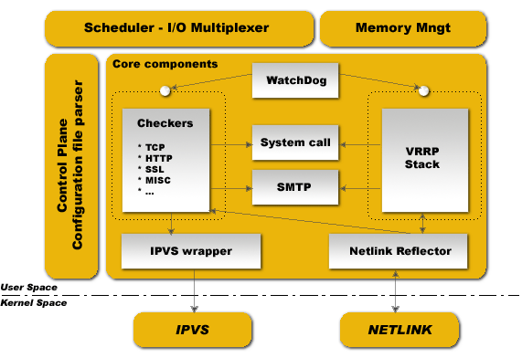

# Documentation

## Reference

<div class="grid cards" markdown>

-   :material-book-open-variant:{ .lg } __User Guide__

    ---

    The complete Keepalived manual covers installation, configuration and the
    load balancing and high availability concepts.

    [:octicons-arrow-right-24: Read the User Guide](documentation/user-guide/index.md)

-   :material-file-document-outline:{ .lg } __Configuration man page__

    ---

    The `keepalived.conf` man page is the exhaustive reference for every
    keyword. The core team maintains it as part of each release.

    [:octicons-arrow-right-24: Open the man page](documentation/keepalived-conf.md)

-   :material-text-box-multiple-outline:{ .lg } __Release Notes__

    ---

    Detailed notes for every release, with the changes, fixes and new
    features that each version brings.

    [:octicons-arrow-right-24: Browse Release Notes](release-notes/index.md)

-   :material-history:{ .lg } __ChangeLog__

    ---

    The full historical ChangeLog records the project evolution back to the
    very first versions.

    [:octicons-arrow-right-24: Read the ChangeLog](documentation/changelog.md)

</div>

## Software design

Keepalived is written entirely in pure ANSI/ISO C. The software is built
around a central I/O multiplexer that provides a real time networking design.
The main goal is a clean modularity between every element, so a core library
removes code duplication, and the code stays safe and auditable to guarantee
production robustness and stability.

To reach that robustness, the daemon splits into up to four processes. A
minimalistic parent process monitors its forked children, while one child runs
the VRRP framework, another runs the health checkers along with the IPVS
configuration, and a third runs the BFD stack. Each child owns its scheduling
I/O multiplexer, which keeps jitter low because VRRP and BFD timing are more
critical than health checking. The split also keeps the health checker isolated
from foreign libraries, so it cannot disturb the more sensitive VRRP and BFD
paths.

{ width="520" }

The parent monitors the children through a framework called the watchdog. Each
child opens a Unix domain socket, and the parent connects to it during
bootstrap and then sends periodic hello packets. When the parent can no longer
deliver a hello packet, it simply restarts the child. The running process list
therefore looks like this:

```text
  PID
  111  keepalived       <-- parent process, monitors children
  112   \_ keepalived   <-- VRRP child
  113   \_ keepalived   <-- health checking child
  114   \_ keepalived   <-- BFD child
```

This design brings two benefits. Because hello packets travel through the I/O
multiplexer, the watchdog can detect a deadlock in a child scheduler. Because
the parent also relies on SysV signals, it can detect a child that has died
and bring it back.

### Components

Control plane
:   Configuration lives in `keepalived.conf`. A compiler style parser walks a
    keyword tree that maps each keyword to a specific handler, and a central
    recursive function reads the file and translates it into an internal
    memory representation.

Scheduler and I/O multiplexer
:   Every event is scheduled in the same process around a central `epoll` event
    loop. POSIX threads are not used. The framework provides its own thread
    abstraction optimised for networking.

Memory management
:   Generic allocation, reallocation and release helpers run in a normal mode
    or a debug mode. The debug mode tracks allocations to eradicate memory
    leaks, protects against buffer under-runs and keeps buffers length fixed
    to prevent overflows.

Core components
:   Common libraries shared across the whole code base, including HTML
    parsing, linked lists, timers, vectors, string formatting, buffer dumps,
    networking helpers, daemon and PID handling and a low level TCP layer.

Health checkers
:   One of the main Keepalived functions. Checkers test whether a real server
    is alive and then add it to or remove it from the IPVS topology. The stack
    uses a fully multi threaded finite state machine and runs in its own
    monitored process.

VRRP stack
:   The other main function. It implements the full IETF RFC5798 standard with
    extensions for LVS and firewall designs, the sync group extension that
    keeps routing paths persistent after a takeover, and legacy IPSEC-AH with
    MD5-96 to secure protocol adverts. The VRRP code can run without LVS
    support.

BFD stack
:   An implementation of Bidirectional Forwarding Detection (RFC5880). The VRRP
    process can use it to track a VRRP instance, and the health checker process
    can use it to test a real server. It runs in its own monitored process.

Netlink reflector
:   Keepalived keeps its own representation of the network interfaces. It sets
    VRRP virtual IPs through Netlink, and it listens to Netlink broadcasts so
    any interface event, even one triggered by another program, is reflected
    into its internal data.

IPVS wrapper
:   Translates the internal data representation into IPVS rules and sends them
    to the kernel through `libipvs`, which keeps the integration generic.

System call and SMTP
:   A forked process can launch an external script during a state transition
    without disturbing the global timer. The SMTP framework notifies
    administrators about health checker activity and VRRP transitions, and it
    can feed any other notification system.

## Guides and papers

Some of these documents are historical and may be out of date, yet they remain
useful to understand the project history and the design rationale.

- [LVS-NAT + Keepalived HOWTO](LVS-NAT-Keepalived-HOWTO.html)
- [Keepalived LVS-NAT director, ProxyArp and firewall HOWTO](Keepalived-LVS-NAT-Director-ProxyArp-Firewall-HOWTO.html)
- [Media link failure detection for modern routers](Link-detection-for-Modern-routers.pdf) (PDF)
- [IPVS syncd strong authentication extension](IPVS-syncd-strong-authentication-extension.pdf) (PDF)
- [draft-ietf-vrrp-ipsecah-spec-00](draft-ietf-vrrp-ipsecah-spec-00.txt)
- [Keepalived internals for LVS-HA using VRRPv2](pdf/LVS-HA-using-VRRPv2.pdf) (PDF, out of date)
- [Keepalived User Guide](pdf/UserGuide.pdf) (PDF, deprecated)
- [LVS + Keepalived Chinese application document](pdf/sery-lvs-cluster.pdf) (PDF)
- JRES 2011 presentation by Alexandre Simon: [paper](pdf/asimon-jres-paper.pdf) and [slides](pdf/asimon-jres-slides.pdf) (PDF, French)
