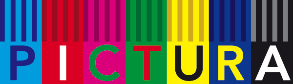
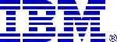

# Sponsors

## Why sponsor Keepalived?

Keepalived is free software, yet maintaining it is not free of effort. The
work on this project targets long term support and evolution. After more than
twenty years of maturation the code has reached its initial goals and is ready
for the next step. Keeping it open and widely accessible improves robustness
and lets good ideas merge quickly, and the code already runs on very large
infrastructures in data centers, ISPs and hardware and software vendors all
around the world.

There are many more ideas around than there is time to build them, so if you
want to help fund a Keepalived release, your support is welcome.

[:material-heart: Sponsor on GitHub](https://github.com/sponsors/acassen){ .md-button .md-button--primary }

## Current sponsors

[{ .sponsor-logo .sponsor-logo--lg }](https://vyos.io)

[VyOS Networking Platform](https://vyos.io) is helping with hosting expenses for
the project and supporting the maintenance effort. Thanks to them for their
support!

## Past sponsors

Over the years several companies funded the addition of new features. Their
support shaped large parts of what Keepalived is today.

**January 2011 · PCEXTREME and PICTURA** jointly sponsored the global IPv6
support. The focus was a massive code rewrite to fully support IPv6 in the
VRRP and IPVS frameworks. Special thanks go to the technical teams at
[PCEXTREME](https://www.pcextreme.nl) and PICTURA for the testing and issue
reports.

[{ .sponsor-logo }](https://www.pcextreme.nl)
[{ .sponsor-logo }](https://www.pictura-im.nl)

**July 2003 · IBM** sponsored the VRRP performance and optimisation work. This
added shared buffers for incoming and outgoing adverts, a shared socket pool
for the outbound channel, an O(1) instance lookup that reduces VRRP scheduling
jitter, a precomputed sync group index and timer auto recalibration.

{ .sponsor-logo }

**May 2003 · Tiscover AG** sponsored the security work and the core daemon
redesign that split the daemon into one parent and two children, with the
watchdog framework that restarts a child if it dies or enters a scheduling
deadlock. Special thanks to Jacob Rief for the design discussions and testing.

[{ .sponsor-logo }](https://www.tiscover.com)

**April 2003 · edNET** sponsored the load balancing framework extensions,
including `virtual_server_group` so a real server can belong to several virtual
servers without launching a flood of health checkers, and IP address range
support.

[{ .sponsor-logo }](https://www.ednet.co.uk)

**March 2003 · Ecomdevel LLC** sponsored the VRRP extensions, including
Netlink route reflection, static and virtual routes driven by the VRRP finite
state machine, per address interface selection and `track_interface` for
interface state monitoring.

[{ .sponsor-logo }](https://www.gigenet.com)
